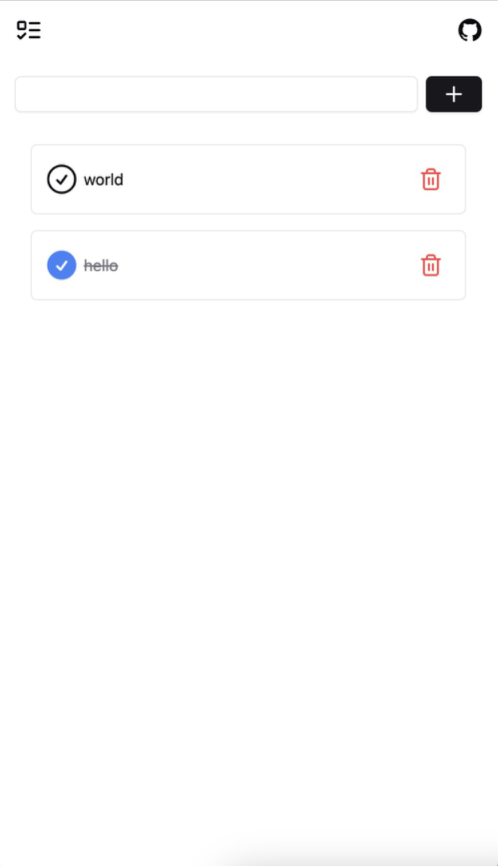

# Welcome to another local first todo app

## https://remixpg.pages.dev/

- PgLite, local-first database, tiny and fast postgresql database
- Remix, the fullstack framework
- Drizzle ORM, a simple ORM to interact with your database, it is sick to use in web client

## Features

- Remix. use remix client loader and client action
- Reactive. It is reactive by default by using remix, no need live extension or any other library
- ORM. Use Drizzle ORM to interact with your database, very productive

## Screenshots

